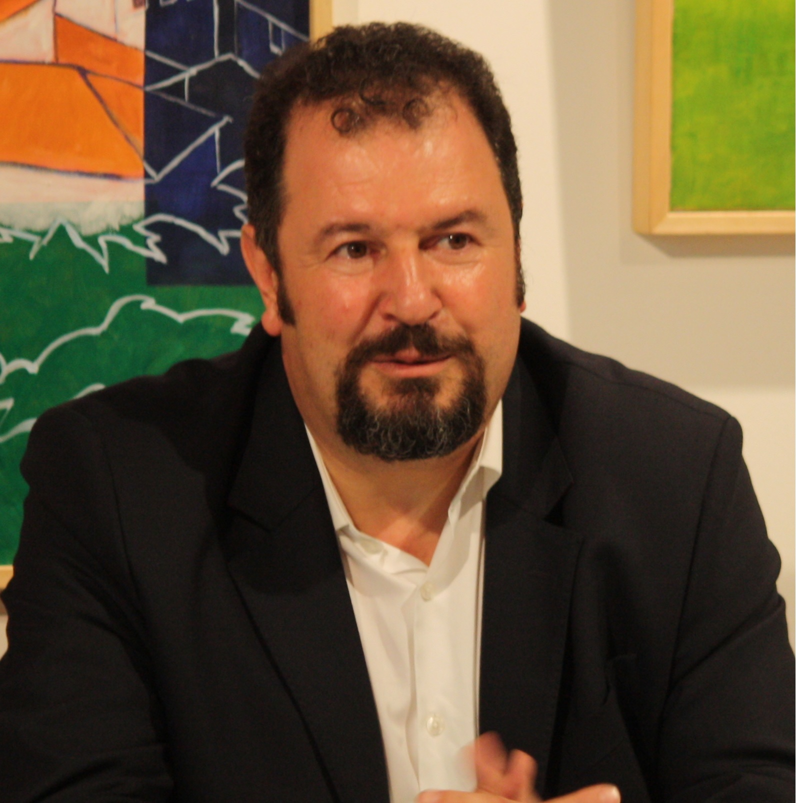

```{r include=FALSE}
colorize <- function(x, color) {
  if (knitr::is_latex_output()) {
    sprintf("\\textcolor{%s}{%s}", color, x)
  } else if (knitr::is_html_output()) {
    sprintf("<span style='color: %s;'>%s</span>", color,
      x)
  } else x
}
```

```{r, include = FALSE}
knitr::opts_chunk$set(
  collapse = TRUE,
  comment = "#>"
)
```

<p style="text-align:justify;"> The bibliography of the authors who contributed to the development of the package that performs interlaboratory studies (ILS), with univariate and functional data, is presented below.</p>


# `r colorize("Authors","#1CA666")`

<br>

|                  |   __Ph.D Miguel Alfonso Flores__ |  
|:-----------------:|:---------------------------|
|{width=300 height=400}| Ph.D. in Statistics and Operations Research, Master in Statistical Techniques (University of La Coruña). He has experience in Education and Higher Vocational Training, university and business in the field of Statistics & Machine Learning. Professor of Probability and Statistics at the National Polytechnic School. Member of the Multidisciplinary Research Group in Information Systems, Technology Management and Innovation (SIGTI) of the National Polytechnic School and the Group of Modeling, Optimization and Statistical Inference (MODES) of the University of La Coruña. |


<br>

|                  |   __Ph.D Salvador Naya__ |  
|:-----------------:|:---------------------------|
|{width=300 height=400}| Ph.D. in Statistics and Operations Research, Master in Statistical Techniques (University of La Coruña). |


