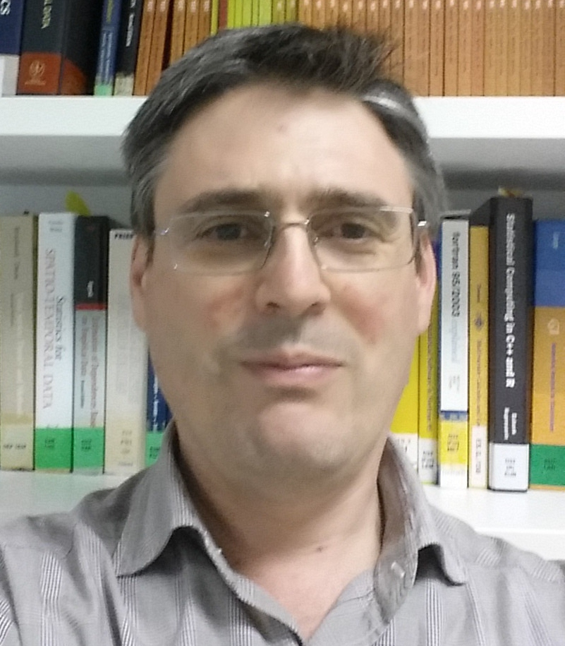
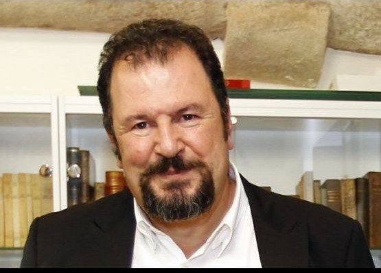

```{r include=FALSE}
colorize <- function(x, color) {
  if (knitr::is_latex_output()) {
    sprintf("\\textcolor{%s}{%s}", color, x)
  } else if (knitr::is_html_output()) {
    sprintf("<span style='color: %s;'>%s</span>", color,
      x)
  } else x
}
```

```{r, include = FALSE}
knitr::opts_chunk$set(
  collapse = TRUE,
  comment = "#>"
)
```

<p style="text-align:justify;"> The bibliography of the authors who contributed to the development of the package that performs interlaboratory studies (ILS), with univariate and functional data, is presented below.</p>


# `r colorize("Authors","#1CA666")`

<table width="100%" border="1"  bordercolorlight="red" bordercolordark="maroon" >
<tr>
<th width="20%" ></th>
<th width="20%" >Ph.D Miguel Alfonso Flores</th>
</tr>
<tr>
<td  width="20%" align="center">{width=300 height=450}</td>
<td  width="20%" align="justify">Ph.D. in Statistics and Operations Research, Master in Statistical Techniques (University of La Coruña). He has experience in Education and Higher Vocational Training, university and business in the field of Statistics & Machine Learning. Professor of Probability and Statistics at the National Polytechnic School. Member of the Multidisciplinary Research Group in Information Systems, Technology Management and Innovation (SIGTI) of the National Polytechnic School and the Group of Modeling, Optimization and Statistical Inference (MODES) of the University of La Coruña</td>
</tr>
</table>

<br>

<table width="100%" border="1"  bordercolorlight="red" bordercolordark="maroon" >
<tr>
<th width="20%" ></th>
<th width="20%" >Ph.D Rubén Fernandez</th>
</tr>
<tr>
<td  width="20%" align="center">{width=300 height=400}</td>
<td  width="20%" align="justify"> Insertar Bibliografia</td>
</tr>
</table>

<br>

<table width="100%" border="1"  bordercolorlight="red" bordercolordark="maroon" >
<tr>
<th width="20%" ></th>
<th width="20%" >Ph.D Salvador Naya</th>
</tr>
<tr>
<td  width="20%" align="center">{width=300 height=400}</td>
<td  width="20%" align="justify">I am professor in Statistics and Operations Research at the University of A Coruña since 1994. My research lines include Parametric and Nonparametric Statistics, Quality Control, Survival Analysis, Functional Data Analysis, Big Data Statistical Analysis and Statistical Methods in Materials Science. I am teaching in the Interuniversity Master in Statistical Techniques (coorganized by the three Galician universities), as well as in the Master in the Master in Complex Materials, Thermal Analysis and Rheology (double international degree with the Paris Diderot), as well as in the master Erasmus Mundus Joint Master Degree: Sustainable ship and shipping  4.0 (international degree with the University of Napoli Federico II and University of Zagreb) and in the Degree in Naval Architecture and Ocean Engineering. 

I am a researcher of the MODES group and I am attached to the CITC research Center, both of the University of A Coruña. I am author of more than 130 papers. He has directed 7 doctoral theses and participated in more than 40 research and transfer projects with companies. 

I have been a delegate of the Student Advice and Promotion Service (SAPE) and Director of the Jorge Juan Catedra. I have been president and co-founder of the "Nerxus Quality Solutions" spin-off. 

I am an associate editor of several scientific journals and an elected member of the International Statistical Institute (ISI). He is Prize "Educator of the Year 2013" for the JLM Project and in 2020, along with 3 other colleagues, I was the winner of the SEIO-FBBVA Award in the category of best applied contribution with an impact in the social field, innovation or knowledge transfer in the field of Statistics. Since March 2016, I am the Vice Chancellor for Scientific Policy, Research and Transfer of University of A Coruña..</td>
</tr>
</table>

<br>

<table width="100%" border="1"  bordercolorlight="red" bordercolordark="maroon" >
<tr>
<th width="20%" ></th>
<th width="20%" >Ph.D Javier Tarrío-Saavedra</th>
</tr>
<tr>
<td  width="20%" align="center">{width=300 height=400}</td>
<td  width="20%" align="justify">Ph.D. in Statistics and Operations Research, Master in Statistical Techniques (University of La Coruña). He has experience in Statistics, Industrial Statistics, Statistical Quality Control, Statistical Learning, Materials Science, Thermal Analysis and Rheology, Bibliometry, Naval and Oceanic Engineering, Industrial Engineering, Energy Efficiency, Epidemiology, Epidemiology.</td>
</tr>
</table>

## Ph.D Miguel Alfonso Flores

<table>
<tr>
  <td>{width=300 height=450 align="center"}</td>
</table>

<p style="text-align:justify;">Ph.D. in Statistics and Operations Research, Master in Statistical Techniques (University of La Coruña). He has experience in Education and Higher Vocational Training, university and business in the field of Statistics & Machine Learning. Professor of Probability and Statistics at the National Polytechnic School. Member of the Multidisciplinary Research Group in Information Systems, Technology Management and Innovation (SIGTI) of the National Polytechnic School and the Group of Modeling, Optimization and Statistical Inference (MODES) of the University of La Coruña.</p>

<br>

## Ph.D Salvador Naya

<br>

<center>{width=300 height=450}</center>

<br>

$\rule{19.5cm}{0.1cm}$

__Catedrático de universidad (CAT-UN)__ 

|   |   |
|:--------|:----------------------------------|
| __Department__  |    Mathematics| 
| __Area__        | Statistics and operations research      |
|__Research__  | <a href=https://investigacion.udc.es/es/Research/Details/G000199> Modeling Optimization and Statistical Inference Research Group</a> |
| __Lines of research__| Parametric and nonparametric curve estimation, design of experiments, sampling, industrial reliability, statistical quality control  |
| __Key words__| Statistical Modeling, Design of Experiments, Reliability, Quality Control  |
| __Contact__| <a href=https://directorio.udc.es/persons/20637> UDC Directory</a> |


<table>
<tr>
<td><a href=https://orcid.org/0000-0003-4931-9859>{} </a></td> 
<td><a href=https://publons.com/wos-op/a/F-7405-2014> {}</a> </td>
<td><a href=https://www.scopus.com/authid/detail.uri?authorId=56262815700> {}</a></td>
</tr>
</table>

<br>

$\rule{19.5cm}{0.1cm}$

### Biography

<p style="text-align:justify;">I am professor in Statistics and Operations Research at the University of A Coruña since 1994. My research lines include Parametric and Nonparametric Statistics, Quality Control, Survival Analysis, Functional Data Analysis, Big Data Statistical Analysis and Statistical Methods in Materials Science. I am teaching in the Interuniversity Master in Statistical Techniques (coorganized by the three Galician universities), as well as in the Master in the Master in Complex Materials, Thermal Analysis and Rheology (double international degree with the Paris Diderot), as well as in the master Erasmus Mundus Joint Master Degree: Sustainable ship and shipping  4.0 (international degree with the University of Napoli Federico II and University of Zagreb) and in the Degree in Naval Architecture and Ocean Engineering. </p>

<p style="text-align:justify;">I am a researcher of the MODES group and I am attached to the CITC research Center, both of the University of A Coruña. I am author of more than 130 papers. He has directed 7 doctoral theses and participated in more than 40 research and transfer projects with companies.</p> 

<p style="text-align:justify;">I have been a delegate of the Student Advice and Promotion Service (SAPE) and Director of the Jorge Juan Catedra. I have been president and co-founder of the "Nerxus Quality Solutions" spin-off.</p>

<p style="text-align:justify;">I am an associate editor of several scientific journals and an elected member of the International Statistical Institute (ISI). He is Prize "Educator of the Year 2013" for the JLM Project and in 2020, along with 3 other colleagues, I was the winner of the SEIO-FBBVA Award in the category of best applied contribution with an impact in the social field, innovation or knowledge transfer in the field of Statistics. Since March 2016, I am the Vice Chancellor for Scientific Policy, Research and Transfer of University of A Coruña.</p>


